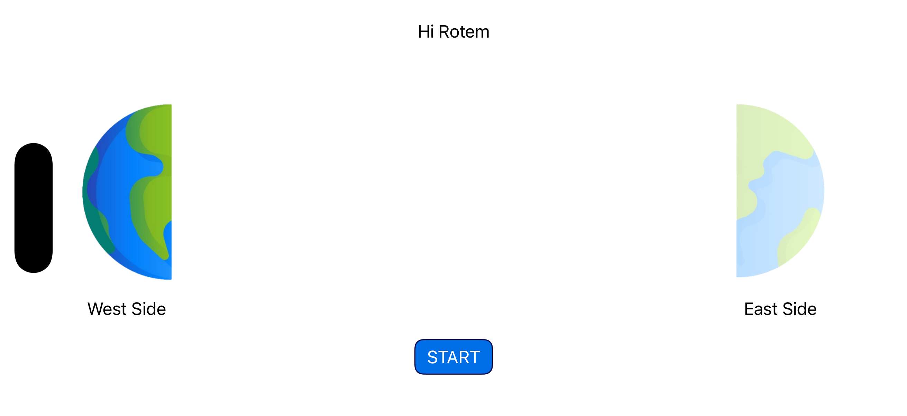
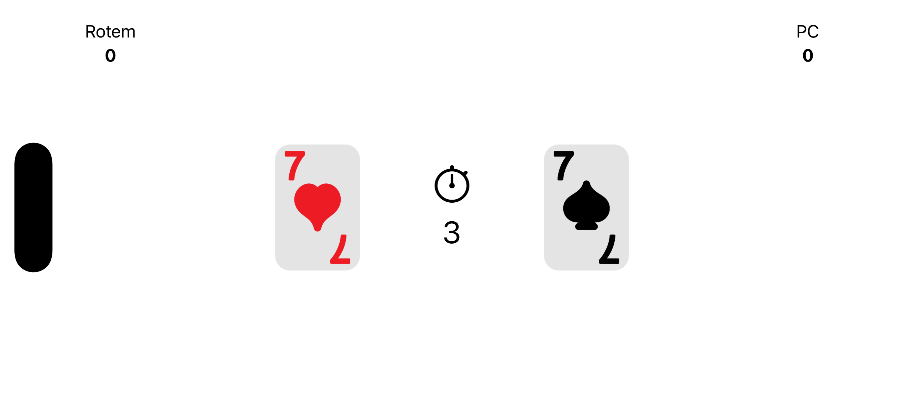
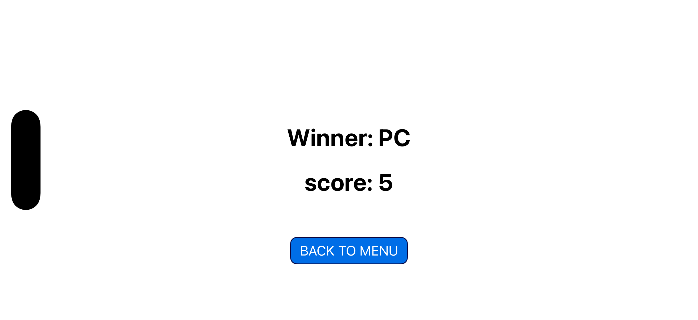
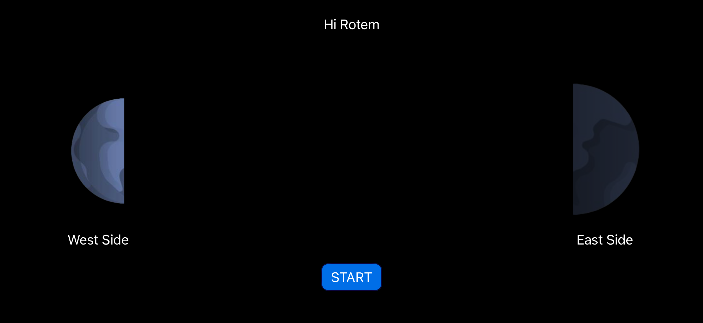
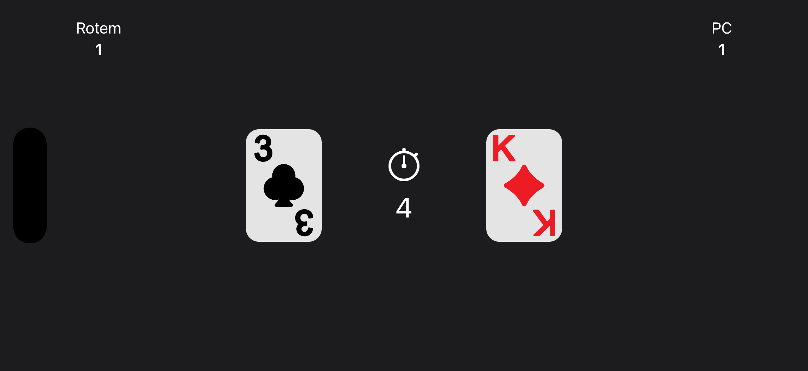
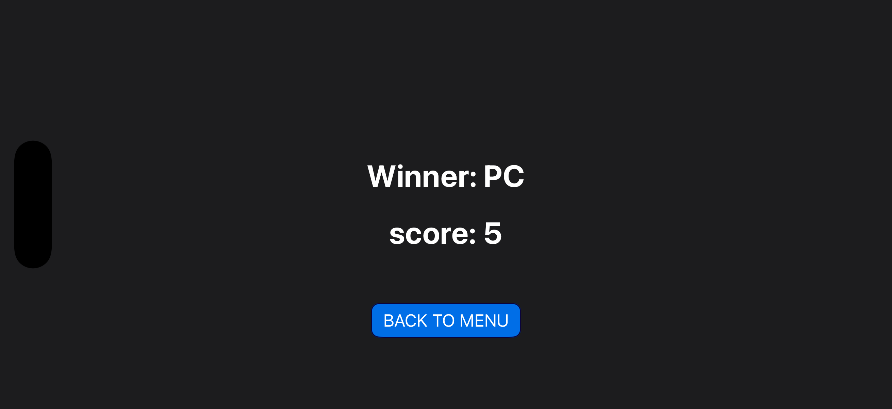

# 🃏 Card Clash - iOS Location-Based Card Game (v2.0)

A dynamic, fully responsive iOS card game built natively in Swift using UIKit. The game features interactive location-based mechanics, automated gameplay loops, an elegant UI with full Dark Mode support, immersive audio, and advanced lifecycle management.

---

## 📺 Video Demonstration
Check out the fully working app gameplay on YouTube:

[](https://youtu.be/85CZH2Irnps)

[](https://youtu.be/85CZH2Irnps)

---

## 📸 Screenshots & UI Design

| Welcome Screen | Active Gameplay | Game Over & Winner |
| :---: | :---: | :---: |
| **Light Mode** | | |
|  |  |  |
| **Dark Mode** | | |
|  |  |  |

---
## 🚀 Key Features & V2 Updates

- **🌗 Full Dark Mode Support:** Seamlessly transitions between Light and Dark appearances using dynamic System Colors (`Label Color`) and adaptive `Asset Catalog` images (e.g., dynamic Earth icons and tinted SVGs), requiring zero programmatic UI overrides.
- **📱 Responsive Auto Layout:** Employs a robust `UIStackView` layout engine tailored to support varying device screens seamlessly, specifically optimized to look perfect in both **Portrait** and **Landscape** orientations.
- **🎵 Immersive Audio Experience:** Integrates `AVFoundation` via a custom Singleton `SoundManager`. Features continuous background music and synchronized sound effects (SFX) for card flipping and game over scenarios.
- **🔄 App LifeCycle Management:** Listens to `NotificationCenter` events (`didEnterBackground` / `willEnterForeground`) to intelligently pause and resume the game clock and background music, preventing battery drain and ensuring a smooth user experience.
- **📍 Real-Time Location Awareness:** Integrates `CoreLocation` to fetch coordinates and automatically assigns the player's side (**East** or **West**) relative to a strict geographic midpoint baseline (`34.817549`).
- **💾 Persistent Data:** Uses `UserDefaults` to save player names via a clean `UIAlertController` text input prompt.

---

## 🏗 Architectural Blueprint

The project is built with clean architecture principles, leveraging **MVC** and the **Delegate Pattern** for maximum decoupling:

- **`SoundManager.swift`**: A dedicated Singleton service managing `AVAudioPlayer` instances for background music and SFX.
- **`GameClock.swift`**: Decouples the timer logic from the UI. Utilizes a custom `GameClockDelegate` protocol to notify the View Controller of state changes, preventing memory leaks using `weak` references.
- **`GameViewController.swift`**: Conforms to the `GameClockDelegate` to handle UI updates. Manages App LifeCycle observers and game state logic.
- **`ViewController.swift` & `SummaryViewController.swift`**: Manage landing/setup flows and final score evaluation using robust storyboard segregation.

---

## 🛠 Tech Stack

- **Language:** Swift 5.x
- **Framework:** UIKit (Storyboard, Auto Layout, UIStackViews)
- **Core APIs:** `CoreLocation`, `AVFoundation`, `UserDefaults`, `NotificationCenter`
- **Architecture:** MVC, Delegate Pattern, Singleton Pattern
- **IDE:** Xcode 15+

---

## 📦 Installation & Setup


1. **Clone the repository:**

```bash

   git clone https://github.com/RotemGilboa2/Card_game_v2.git

```


2. **Open the project in Xcode:**

   - Double-click the `.xcodeproj` file to launch the environment.

3. **Simulate Coordinates:**

   - Since the game relies on `CoreLocation`, remember to simulate location coordinates within the Simulator via: `Features > Location > Custom Location...` to test the dynamic **East / West** sorting.

4. **Run the Application:**

   - Press `Cmd + R` to compile and launch the simulator.


---


## 👤 Author


<br><br>

  <b>Let's Connect! 🤝</b>

  <br><br>

[](https://www.linkedin.com/in/rotem-gilboa-bb2689246/)

[](https://github.com/RotemGilboa2) 

